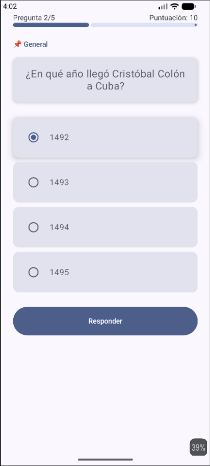

# QuizCUJAE



## Descripcion

QuizCUJAE es una aplicacion mobile de trivia y quizes desarrollada para el disfrute de estudiantes de la CUJAE. Los usuarios pueden poner a prueba sus conocimientos mediante preguntas de opcion multiple con un sistema de puntuacion.

Actualmente la app contiene preguntas con placeholders sobre Cuba como contenido de prueba, con el objetivo de ser expandido con preguntas reales de la carrera y tematicas de la universidad.

## Stack Tecnologico

- **Lenguaje:** Kotlin
- **UI Framework:** Jetpack Compose (Material 3)
- **Arquitectura:** Single-Activity con navegacion por estado (sin Navigation Component)
- **Plataforma:** Android (minSdk 24, targetSdk 36)
- **Build System:** Gradle con Kotlin DSL
- **IDE:** Android Studio

### Dependencias principales

| Dependencia | Uso |
|---|---|
| `androidx.compose.material3` | Componentes UI con Material Design 3 |
| `androidx.activity.compose` | Integracion Compose con Activity |
| `androidx.compose.ui` | Framework de UI declarativo |
| `androidx.lifecycle.runtime.ktx` | Ciclo de vida con Kotlin extensions |

## Estructura del Proyecto

```
app/src/main/java/com/example/quizcujae/
├── MainActivity.kt          # Activity principal y navegacion
├── data/
│   ├── Question.kt          # Modelo de datos de pregunta
│   ├── QuestionCategory.kt  # Enum de categorias
│   └── QuestionRepository.kt# Repositorio de preguntas (hardcoded)
└── ui/
    ├── screens/
    │   ├── WelcomeScreen.kt  # Pantalla de bienvenida
    │   ├── QuizScreen.kt     # Pantalla del quiz
    │   └── ResultScreen.kt   # Pantalla de resultados
    └── theme/
        ├── Color.kt
        ├── Theme.kt
        └── Type.kt
```

## Funcionalidades Actuales

- Pantalla de bienvenida con instrucciones
- Quiz de 5 preguntas de opcion multiple
- Sistema de puntuacion (10 puntos por respuesta correcta)
- Barra de progreso visual
- Retroalimentacion visual (verde/rojo) al responder
- Mensajes motivacionales segun la puntuacion
- Opcion de reiniciar el quiz

## Features Futuras

- [ ] **Mejora en la interfaz** - Animaciones, transiciones entre pantallas, modo oscuro, y diseno mas pulido
- [ ] **Persistencia con SQLite** - Guardar puntuaciones historicas, progreso del usuario y banco de preguntas en base de datos local
- [ ] **Multijugador por red local** - Modo de juego conectado via WiFi/hotspot donde multiples jugadores compiten en tiempo real
- [ ] **Banco de preguntas expansible** - Carga de preguntas desde archivos JSON o servidor
- [ ] **Categorias y filtros** - Seleccion de tematicas (Informatica, Historia, Matematicas, etc.)
- [ ] **Temporizador por pregunta** - Modo contrareloj con limite de tiempo

## Como Ejecutar

1. Clona el repositorio
2. Abre el proyecto en Android Studio
3. Sincroniza Gradle
4. Ejecuta en un emulador o dispositivo Android (API 24+)